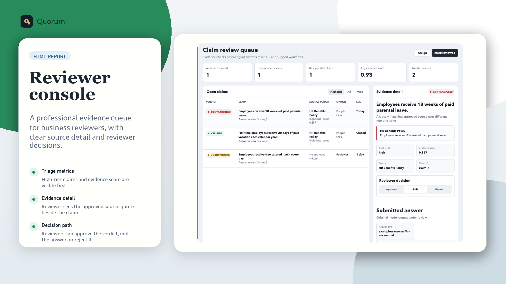

# Quorum

[](https://github.com/nash226/quorum/actions/workflows/ci.yml)

Quorum is an evidence gate for enterprise AI agents. It checks AI-generated
business claims against approved company sources before answers reach
customers, employees, tickets, workflows, or downstream systems.

## Why Quorum Exists

AI answers can sound confident while drifting from approved policy. Quorum
breaks an answer into claims, compares each claim with source evidence, and
returns reviewer-ready `verified`, `contradicted`, `unsupported`, or
`needs_review` verdicts. The first wedge is HR and customer-support policy
verification, where grounded answers are high-volume and costly to get wrong.
Claim extraction also normalizes bracketed, Arabic-Indic, Persian, and fullwidth ordered-list
markers plus common Unicode bullets such as middle dots and square bullets,
keeping exported and localized answers clean before evidence matching. Markdown
policy tables are also reduced to row-level claims, including tables that omit
the optional outer pipe characters.

## Quick Start

The published package smoke check also runs the CLI `verify-batch` contract,
including a verified answer alongside an empty draft so batch routing stays
machine-readable after packaging. It also exercises the packaged
`review-queue` command, including its generated timestamp and JSON/CSV queue
overview artifacts, plus the HTTP queue's `queueStatus` and policy-domain
filters. The packaged HTTP claim-preview check also covers Markdown table rows,
so the published artifact keeps table headers and separators out of claims.

```bash
npm install
npm run check
npm run dev -- verify \
  --answer examples/answers/hr-answer.md \
  --source-dir examples/sources \
  --json
```

For agent integrations, run the local HTTP service and use its discovery
contract before sending verification requests:

```bash
npm run dev -- serve --port 3000
curl http://127.0.0.1:3000/health
curl http://127.0.0.1:3000/openapi.json
curl -X POST http://127.0.0.1:3000/verify \
  -H 'content-type: application/json' \
  -d '{"answer":"Employees receive 12 weeks of paid parental leave.","sources":[{"sourcePath":"hr-policy.md","content":"Employees receive 12 weeks of paid parental leave."}]}'
```

HTTP responses include a request correlation ID, and `/openapi.json` is the
machine-readable source of truth for request and response schemas. The service
also exposes `/verify-batch`, `/import-review`, `/review-queue`,
`/extract-claims`, and `/evaluate`; run `npm run dev -- serve --help` for the
full endpoint list and local configuration options.

`npm run check` is the full local release gate: it runs tests and the TypeScript
build, then smoke-checks the HTTP API and packaged CLI before enforcing the
checked-in evaluation score and mismatch thresholds.
The roadmap now treats reviewer queues and the local API as shipped foundations;
the next persistence and dashboard boundary remains an explicit product
decision rather than an unscoped implementation task.

Verification accepts Markdown, text, exported HTML, PDF, and DOCX answers and
approved sources. Use `--source-dir` for a mixed directory of policy files;
answer and source directories are searched recursively, so nested policy or
queue folders can be verified without flattening the approved file layout. The
CLI also deduplicates repeated source paths, keeping each approved document
represented once in the evidence report. The
[CLI guide](docs/cli-guide.md) documents format-specific and streaming details.
When a workflow has an explicit source set, repeat `--source` instead of
creating a temporary directory:

```bash
npm run dev -- verify \
  --answer examples/answers/hr-answer.md \
  --source examples/sources/hr-benefits.md \
  --source examples/sources/support-playbook.md \
  --json
```

This direct-source form and `--source-dir` can be combined; explicit sources
are evaluated first and directory-discovered sources are appended. That keeps
curated policy order stable while still allowing a shared source directory.
The HTTP `verify` endpoint accepts PDF and DOCX answer/source bytes as base64
JSON content, preserving the supplied paths and source metadata in its result.
The HTTP `verify-batch` endpoint also preserves caller-supplied source IDs in
both the batch and per-answer reports, keeping evidence references durable for
multi-answer workflow consumers.
Malformed JSON requests fail closed with a 400 response containing the same
structured `error` and `requestId` fields as other HTTP validation failures.
Use `--generated-at <timestamp>` when a batch run needs one caller-owned audit
timestamp across every answer and exported reviewer artifact.
Batch text, Markdown, and HTML reports also show the configured `--fail-on`
verdicts alongside each answer's match status, preserving the CI policy in
exported review artifacts.
The same batch fail policy is available over HTTP: with `failOn` and
`failOnStatus`, a risky batch returns HTTP `409` plus `shouldFail` and
`failVerdicts` metadata for workflow gating.

For an agent or workflow runner that needs JSON over HTTP, start the local API
and probe its published capability contract:

```bash
npm run dev -- serve --port 3000
curl -fsS http://127.0.0.1:3000/capabilities
```

The [HTTP integration guide](docs/api-integration.md) covers verification,
reviewer-queue, health, readiness, liveness, and OpenAPI discovery endpoints.
The packaged HTTP smoke gate also evaluates an inline HR fixture with a domain
filter, keeping published scorecard and generated-timestamp behavior covered.
It also submits a deliberately mismatched fixture with `failOnStatus`, keeping
the published HTTP evaluation gate fail closed with a `409` response.

Node.js workers can use the built package directly when starting an HTTP server
would add unnecessary overhead. The public `quorum` entrypoint exposes the same
in-memory and file-backed verification helpers used by the CLI; see the
[programmatic API guide](docs/programmatic-api.md) for both patterns.
The guide also documents the in-memory batch result contract for queue workers,
including its `shouldFail` and `failVerdicts` gate metadata.
File-backed programmatic verification also rejects empty source directories,
so API and CLI workflows share the same fail-closed evidence requirement.
The packaged programmatic API smoke gate exercises that rejection after build,
so published workers cannot silently run without an approved source set.

For example, an agent worker can verify content in memory and fail closed on
risky verdicts without starting a second process:

```ts
import { verifyAnswerContentsResult } from "quorum";

const result = await verifyAnswerContentsResult({
  answer: "Refunds are available for 30 days from purchase.",
  answerLabel: "support-agent draft",
  sources: [{
    id: "support/refunds@2026-07-15",
    sourcePath: "policies/refunds.md",
    content: "Refunds are available for 30 days from the purchase date.",
    title: "Refund Policy",
    trustLevel: "high",
  }],
  failOn: ["contradicted", "unsupported"],
});

if (result.shouldFail) {
  throw new Error(`Policy verification failed: ${result.failVerdicts.join(", ")}`);
}
```

The stable source `id` is carried into evidence and reviewer artifacts, so
workers can keep audit identity independent of temporary file paths.

The packaged CLI command map is:

| Command | Use it to |
| --- | --- |
| `verify` | Verify one answer and render reviewer artifacts. |
| `verify-batch` | Verify multiple answers and create queue summaries. |
| `extract-claims` | Preview normalized claims before verification. |
| `import-review` | Import reviewer decisions and apply fail policies. |
| `review-queue` | Summarize reviewer workload with optional benchmark drift. |
| `evaluate` | Run fixture scorecards and mismatch gates. |
| `serve` | Start the local HTTP API. |
| `openapi` | Export the machine-readable API contract. |
| `version` | Probe the CLI and API contract version. |

The version probe is also available as `quorum --version` and `quorum -v`,
which is useful for installation checks that do not use a subcommand.

Every command supports `--help` and `-h`; `quorum help <command>` is also
available for scripted onboarding. Use `--result-json` when an integration
needs `shouldFail` and `failVerdicts` alongside a report, and use `--answer -`
or `--review-csv -` to stream one input from stdin.
The top-level alias also accepts `quorum help --help`, which is useful for
wrappers that append a help flag consistently.
The top-level help now lists the full shipped command map, including the
review-queue, evaluation, API, and contract-version entry points.
It also keeps source IDs, aggregate CSV exports, and reviewer queue filters
visible in the one-screen command synopsis so integration setup does not need
to guess which command-specific options are available.

The packaged CLI smoke gate probes representative `quorum help <command>`
topics after building, keeping the documented onboarding alias executable in
published artifacts. It also probes the published `help version` topic, keeping
CLI contract discovery covered after packaging.
The version command and its `--version`/`-v` aliases also accept `--help` and
`-h`, so wrappers can append a help flag consistently to any published command.

For a queue handoff, export the reviewer CSV during verification, then combine
reviewer workload with benchmark drift in one machine-readable overview:

```bash
npm run dev -- review-queue \
  --review-csv reports/batch-review.csv \
  --fixture-dir examples/evaluations \
  --queue-status pending \
  --json --out reports/review-queue.json \
  --csv-out reports/review-queue.csv
```

The `pending`, `reviewed`, and `no_claims` filters apply to answer groups, so a
workflow can route only the work that still needs attention. The same queue
summary is available through the HTTP API and the programmatic API, while
`evaluate` remains the CI gate for fixture mismatches and minimum score.

It also checks that packaged `/health`, `/healthz`, `/readyz`, and `/livez`
endpoints support bodyless `HEAD` probes for deployment health checks.
The same packaged HTTP gate exercises the readiness query aliases
`/healthz?probe=readiness` and `/readyz?probe=kubernetes`, keeping probe routing
available in the published server artifact.
Unit coverage also verifies bodyless `HEAD` probes for the root discovery,
version, and OpenAPI contract routes, so lightweight clients can check those
documents without downloading response bodies.
These four operational routes currently share the same process-health
envelope; readiness is not dependency-aware yet, so integrations should treat
them as serving probes until a durable dependency boundary is shipped.

For a single answer, `--summary-csv-out` writes the same queue-oriented
one-row summary used by batch verification, including verdict totals, the
primary finding, and fail-policy status. This is useful when a workflow wants
to route one answer without parsing the full JSON report.

Word-based workflows use the same command and report formats:

```bash
npm run dev -- verify \
  --answer answers/customer-response.docx \
  --source policy/returns-policy.docx \
  --json --out reports/customer-response.json
```

The packaged CLI smoke gate verifies DOCX answers and approved sources after
build, so this integration path stays covered for published artifacts.
The packaged HTTP smoke gate also preserves caller-supplied source IDs, titles,
update timestamps, and trust levels in verification reports, keeping audit
metadata stable for downstream consumers.
The packaged evaluation smoke gate also checks the `--result-json` response,
keeping `shouldFail`, mismatch totals, and fail-policy metadata available to CI
callers after installation.

For a CI gate, add `--fail-on contradicted --fail-on unsupported`.
Use `--fail-on needs_review` when empty or uncertain answers must stop for
human review; the CLI treats answers with no extracted claims as a review-policy
failure too. See the [CLI guide](docs/cli-guide.md#fail-policy-gates) for the
copy-pasteable example.

Integrations can check the installed CLI and API contract version without
starting the server:

```bash
npm run dev -- version --json
# {"service":"quorum","version":"0.1.0"}
```

The CLI and HTTP API read this version from `package.json`, keeping published
package metadata and integration discovery responses aligned.
Use `quorum help version` when onboarding a script that needs the exact version
probe syntax.

Client tooling can export the same machine-readable HTTP contract without
starting the server:

```bash
npm run dev -- openapi --out reports/quorum-openapi.json
```

Use `--server-url` when the generated document should point at a deployed
Quorum endpoint; the [HTTP integration guide](docs/api-integration.md) covers
the corresponding discovery and request contracts.

To run those contracts locally for an agent or workflow runner:

```bash
npm run dev -- serve --host 127.0.0.1 --port 3000
curl http://127.0.0.1:3000/capabilities
curl http://127.0.0.1:3000/openapi.json
```

The service exposes the same verification, reviewer-import, queue, and
evaluation surfaces as the CLI. Node.js callers can use the public
`quorum` package entrypoint instead of starting a server; see the
[programmatic API guide](docs/programmatic-api.md) for that integration path.

The package smoke check also executes the published `quorum version --json`
entrypoint, keeping the installed CLI contract aligned with the package
manifest and library exports.
It also imports a completed review CSV from stdin with `--result-json`, keeping
pipe-friendly reviewer fail-policy handoff executable after packaging.
It also starts the packaged server entrypoint and probes `/version` and
`/openapi.json`, so a published server cannot pass packaging checks merely by
having importable exports while its HTTP contract is broken.
The same packaged check probes `/capabilities`, preserving the published
request limits and reviewer queue status vocabulary used by integrations.
The same packaged smoke check submits a minimal `/verify` request and expects a
verified claim, keeping the published server's core evidence path executable.
It also submits a contradictory `/verify` request with `failOnStatus`, keeping
the published server's `409` fail-policy contract executable for CI callers.
It also submits a claim-bearing answer and an empty draft to packaged
`/verify-batch`, verifying that queue consumers receive the expected
claim-bearing and no-claims totals.
The same packaged check now probes `/health`, `/readyz`, and `/livez`, keeping
published operational health, readiness, and liveness responses verified.
It also probes the packaged root discovery document and bodyless `HEAD /` route,
keeping the first integration handshake and request-correlation contract executable.
It also checks the published `quorum --version` and `quorum -v` aliases, so
short-form version probes remain compatible with installed integrations.
It also executes `quorum --help` from the built package artifact and checks the
primary `verify` and `serve` commands, so a published CLI remains discoverable
before installation into an integration environment.
The same packaged smoke gate probes both `--help` and `-h` for every published
CLI command, keeping command-specific onboarding available to shell users and
integration setup scripts.
The equivalent `quorum help <command>` form is also supported for scripted
onboarding and terminal users who prefer an explicit help subcommand.
The same packaged smoke gate exports `quorum openapi --out` and validates the
written document, keeping offline contract generation aligned with the
published CLI.
It also runs the packaged `quorum evaluate --fixture` command against the
checked-in HR fixture with `--fail-on-mismatch`, keeping published benchmark
execution and its zero-mismatch gate executable after packaging.
It also executes the packaged `quorum extract-claims --result-json` workflow,
keeping normalized claim IDs and the `answerHasClaims` routing signal aligned
with the published CLI artifact.
It also runs the packaged `quorum import-review` command against a completed
review CSV, keeping reviewer verdict routing and fail-policy output executable
after packaging. It also streams that CSV into the packaged `quorum review-queue`
command, keeping pipe-friendly queue summaries executable after packaging.
The packaged gate also writes and checks `import-review --queue-summary-csv-out`,
so downstream queue consumers have an executable summary artifact contract.
It also verifies a text answer against the packaged PDF policy fixture, keeping
the published CLI's PDF source-ingestion path executable after packaging.
It also verifies a DOCX answer and source through the packaged CLI, keeping the
published artifact's DOCX ingestion path executable after packaging.
It also streams an approved Markdown source through `--source -`, keeping the
published CLI's pipe-friendly source-ingestion path executable after packaging.

The shipped CLI artifact now has an executable smoke gate for DOCX answers and
approved sources, alongside the existing Markdown, HTML, and PDF paths.
The same packaged gate pins `verify --generated-at` for a single answer, so
caller-owned audit timestamps stay deterministic outside batch workflows too.
It also checks that packaged single-answer verification writes a queue-oriented
summary CSV, including the streamed answer path and verified verdict, so a
workflow can route one answer without parsing the full report.
The packaged batch gate also writes and validates the aggregate summary CSV,
keeping total answer, claim, verdict, and source counts available as one row
for queue consumers.

HTTP integrations can also use `HEAD /version` for a bodyless version probe;
it returns the same discovery headers and a cache validator as the JSON route.
The core API regression suite also pins conditional `GET /version` revalidation,
so cache-aware clients can receive `304 Not Modified` without a body.
The root discovery, capabilities, and OpenAPI probes also support conditional
`HEAD` requests, returning `304 Not Modified` when their `ETag` is current.
The [HTTP integration guide](docs/api-integration.md#discover-and-probe-the-service)
includes a copy-pasteable validator example for cache-aware clients.
That same conditional probe works for `/capabilities` and `/openapi.json`, so
clients can refresh runtime limits or the machine-readable schema only when
their cached contract ETag is stale.
The same discovery responses advertise the configured JSON request-size and
request-timeout limits; operators can tune them with `--max-request-bytes` and
`--request-timeout-ms`, while clients can read the corresponding capability
fields before submitting larger or slower requests.
It also documents the separate `/livez` liveness probe for container and
load-balancer checks, alongside the readiness-only `/healthz` probe.
The liveness response is a request-correlated health envelope, and its
`X-Quorum-Request-Id` header can be joined with service logs; liveness remains
independent of source loading and reviewer queue state.
The API regression suite also verifies that `/readyz` and `/livez` publish the
same discovery, limit, and request-correlation headers, keeping container probes
observable as well as bodyless.
The `quorum serve --help` contract also lists both `/livez` methods, so operators
can discover the liveness probe directly from the packaged CLI.
Operational probes support bodyless `HEAD` requests as well as `GET`, so
load balancers can check status headers without downloading a JSON payload.
The API regression suite also verifies that Kubernetes-style `GET /readyz`
readiness probes return the same request-correlated, no-store health envelope.
Browser-based monitors can also preflight `/health`, `/healthz`, `/readyz`, and
`/livez`; each route preserves the advertised origin, `GET, HEAD, OPTIONS`
methods, request-ID header, and ten-minute preflight cache contract.
The packaged HTTP smoke gate also preflights every advertised endpoint, keeping
browser clients aligned with the discovery and CORS contract.
It also submits a reviewed CSV to the packaged `/review-queue` endpoint and
checks its filtered workload totals, keeping reviewer queue handoff executable
after publication.
Use `POST /extract-claims` when a workflow needs to preview normalized claim IDs
and route empty drafts before loading approved sources; the [HTTP integration
guide](docs/api-integration.md#preview-claims-before-verification) includes the
request shape and base64 document example.
The packaged HTTP smoke gate verifies both plain-text and base64 answer preview
inputs, keeping uploaded answer integrations aligned with the published artifact.
It also verifies that the packaged `/capabilities` response advertises every
supported source and answer format plus the complete source trust-level set, so
client integrations can configure ingestion from the published contract.
The packaged HTTP smoke gate also pins the claim-less preview response, keeping
empty drafts visible for reviewer routing instead of treating them as missing.
It also exercises a claim-bearing `/extract-claims` request from the packaged
server, keeping preview claim IDs and normalized text aligned with the
published artifact.
It also preserves a claim-less packaged preview with its request ID and empty
claim list, keeping drafts such as acknowledgements visible for reviewer
routing after publication.
All JSON POST endpoints enforce the advertised request-size limit and return a
structured `413` error when a payload is too large, so adding a new route cannot
silently bypass the operational guard.
Malformed JSON POST bodies also return a structured `400` error with the caller's
request ID, and the packaged smoke check pins that contract on `/verify`.
The packaged smoke check also covers the same malformed-body contract across
`/verify-batch`, `/import-review`, `/review-queue`, and `/evaluate`, so each JSON
POST route preserves the same safe client-error boundary.
It also verifies that every JSON POST route rejects non-JSON content types with
the same structured `415` response and preserves caller-supplied request IDs.
The packaged smoke check exercises browser preflight across all six POST
route, keeping CORS method, header, origin, cache, and bodyless-response
contracts aligned as new JSON endpoints are added.
The same end-to-end benchmark smoke check now preserves the durable source ID
for the support guest-access fixture, so reviewer artifacts remain traceable
to the approved policy snapshot.
The API regression suite also pins the reviewer queue's browser preflight,
including its allowed POST method, request headers, exposed headers, and
bodyless 204 response, so web-based queue consumers keep the same CORS contract
as the packaged smoke gate.
It also verifies the version endpoint's JSON response, bodyless `HEAD` probe,
and conditional `304` response in the packaged HTTP smoke gate.
The [HTTP integration guide](docs/api-integration.md#handle-malformed-json)
includes a copy-pasteable malformed-body example and distinguishes this client
error from route validation (`400`) and request-size (`413`) failures.

The HTTP integration guide also includes a copy-pasteable `POST /verify-batch`
request, including empty-answer routing and reviewer artifact output for queue
consumers.
Unsupported methods now return a structured 405 response with the route's
`Allow` header, so HTTP clients can recover from method mismatches without
guessing the API contract.
The packaged HTTP smoke gate also verifies that unknown routes return a
structured 404 with the caller's request ID, so deployment typos fail clearly
without losing trace correlation.
The packaged smoke check also verifies that an invalid reviewer queue status
returns a structured 400 error with its request ID, keeping queue consumers
from silently falling back to an unfiltered overview.
The `POST /review-queue` response preserves a caller-supplied
`X-Quorum-Request-Id` in both the JSON payload and response header, so queue
handoffs can correlate results with an upstream trace.
The packaged smoke check pins that correlation contract end to end and verifies
that `queueStatus: "pending"` filters the reviewer totals without changing
optional benchmark metrics.
It also pins caller-supplied request-ID correlation on `POST /evaluate`, so
benchmark runs can join result payloads and response headers to an upstream
trace.
It also verifies that `/capabilities` advertises the complete reviewer routing
contract (`pending`, `reviewed`, and `no_claims`) for queue consumers.
The same packaged smoke check now exercises the `/review-queue` browser
preflight, pinning its allowed origin, request headers, methods, and ten-minute
cache lifetime for web-based reviewer handoffs.
HTTP reviewer imports also document stable request IDs and caller-supplied
audit timestamps, so retried queue handoffs can be correlated and compared
without relying on generated-at wall-clock differences.

The full CLI workflow, report options, source metadata, reviewer import, and
evaluation commands are in [docs/cli-guide.md](docs/cli-guide.md).

Pipeline integrations can also stream one approved Markdown or text source via
`--source -` when the answer is supplied from a file:

```bash
cat approved-policy.md | npm run dev -- verify --answer generated-answer.md --source - --json
```

The same pipeline path accepts one Markdown or text policy from stdin; use a
file path or `--source-dir` for additional or binary-format sources.
The packaged smoke gate also verifies the published `quorum verify --answer -`
path, so integrations can stream an answer directly without a temporary file.
It also verifies that packaged `verify-batch` can combine one streamed answer
with explicit answer files while preserving input order and `<stdin>` provenance.
That packaged batch smoke also pins a caller-supplied `--generated-at` timestamp
through the aggregate and per-answer reports for reproducible audit handoffs.

For reviewer handoffs, Quorum can generate claim-level decision CSVs, import
completed reviewer verdicts, and summarize pending/reviewed/no-claims workload
for a queue consumer. The same overview is available through `POST
/review-queue`; see the [reviewer queue workflow](docs/reviewer-queue.md) and
[HTTP integration guide](docs/api-integration.md#summarize-a-reviewer-queue)
for the artifact fields and request examples.
Domain-scoped queue overviews fail closed when the selected domain has no
fixtures, so an empty benchmark scope cannot appear healthy to a dashboard or
handoff consumer.

Reviewer queue imports also document the stable queue-summary CSV header and
which fields are safe for downstream consumers to select by name; see the
[reviewer queue workflow](docs/reviewer-queue.md#3-import-the-completed-decisions).
The packaged HTTP smoke gate also imports a completed reviewer CSV, preserving
request-ID correlation, fail-policy routing, queue totals, and the summary CSV
artifact in the published server.
It also exercises the no-claims queue filter with an empty draft, keeping
reviewer handoff routing for answers that need human review without extracted
claims executable after publication.

The repository check also runs a package-artifact smoke test after building,
confirming that published output includes the README and every file declared by
the package `main`, `types`, `exports`, and `bin` fields, as well as the CLI,
library, and HTTP server entry points. It also imports the root and server entry points
and checks their required runtime exports, so a package can fail closed before
publication if its declared API surface is missing.
The same packaged check verifies that the public `API_VERSION` export matches
the package version, keeping library callers and HTTP/CLI discovery on one
contract version.

The checked-in 77-fixture benchmark spans 27 HR and 50 support workflows, including
leave, onboarding, payroll, accommodations, refunds, refund status, account
security, billing, tax exemption, delivery, service levels, gift cards, and accessibility requests. Authentication-device security is also covered as a reviewer-facing support packet. Each packet exercises reviewer-facing
verdict routing against approved Markdown, HTML, PDF, or directory-backed
sources. See the [evaluation fixture guide](docs/evaluation-fixtures.md) for
the current coverage inventory and extension workflow.
Run `npm run evaluate:ci` to execute the full checked-in benchmark with the
aggregate score and mismatch gates enabled; it is the same fail-closed check
used before publishing the package.
The benchmark also covers phone-support availability boundaries and callback
timing, so universal access and urgent-response promises are checked against
approved support policy before they reach a customer.
Regression tests verify the total and HR/support split so adding a fixture keeps
this product snapshot and the [fixture guide](docs/evaluation-fixtures.md)
accurate.
The inventory contract also rejects fixtures with an unknown domain and keeps
the published 77-fixture total explicit, so new benchmark packets cannot drift
the README silently.
Fixture summary contracts also reject unknown verdict fields, so a typo cannot
silently weaken a CI evaluation gate.
The evaluation mismatch guard also fails closed when either verdict totals or
matched-claim counts drift, keeping scorecard and aggregate gates reviewable.
The fixture loader now applies the same fail-closed rule to unknown top-level
fields, so misspelled answer, source, or expectation keys fail before scoring.
The evaluator also regression-tests the support-only domain filter, keeping
focused support scorecards aligned with the 50-fixture benchmark slice.
Reviewer-queue JSON and CSV handoffs now echo any selected benchmark domains,
so downstream consumers can audit the scope that produced their drift metrics.
The packed smoke check also verifies that the evaluation summary CSV contains
exactly one data row for each of the 77 checked-in benchmark fixtures.
It also cross-checks that row count against the aggregate summary's fixture
count, keeping machine-readable benchmark artifacts internally consistent.
The packed smoke check also reconciles each domain summary's fixture count
against the per-fixture CSV, preventing HR/support scorecards from drifting
out of sync with their underlying benchmark rows.
It also pins the baseline HR leave packet in the report and summary CSV,
preserving contradiction, verification, and unsupported-claim routing.
It now also pins the support source-directory fixture in the packed report and
summary CSV, preserving directory-backed source discovery as an end-to-end
reviewer handoff behavior.
The packed smoke check also pins the root support-policy fixture in the report
and summary CSV, preserving the baseline support verdict mix in the packaged
evaluation gate.
It also pins the support account-security packet's two verified controls and
contradicted refund claim in that CSV, keeping account-policy evidence visible
to reviewer-facing consumers.
The packed smoke check now pins account contact-change verification, contradiction,
and unsupported routing in the summary CSV as well.
The packed smoke check now also pins authorized-contact coverage, preserving the
account-owner confirmation control before support discussions or billing changes.
It also pins the empty-answer fixture as a zero-claim CSV row, so an empty draft
remains visible to downstream reviewer handoffs instead of looking like a
missing benchmark result.
The packed smoke check also pins account-suspension verdict counts in the
summary CSV, keeping appeal, reinstatement, and billing-evidence claims stable.
It now also asserts that account-security coverage appears in the packed
benchmark report, keeping account-control verification and contradiction
routing visible in the end-to-end smoke gate.
The HR benchmark now also covers annual bonus eligibility, preserving good-standing
verification while catching payout-timing drift and unsupported guaranteed-bonus claims.
The packed smoke check also verifies this bonus-eligibility packet in the generated
report and summary CSV, keeping its compensation verdict paths covered end to end.
Direct regression coverage now also pins the support warranty fixture's claim,
eligibility-conflict, and unconditional-replacement verdict paths.
The end-to-end smoke gate also preserves HR time-off routing, keeping the
verified notice rule, two needs-review claims, and unsupported stipend claim
visible in the generated benchmark summary.
It now also verifies that HR onboarding coverage appears in the packed report,
keeping healthcare, equipment, and unsupported manager claims in the smoke gate.
The HR benchmark also includes jury-duty leave coverage, keeping a verified
entitlement, conflicting duration, and unsupported stipend claim reviewable.
The reviewer-queue regression also tracks the current answer handoff total, so
fixture coverage and queue summaries stay aligned as the benchmark grows.
The support benchmark now also covers holiday service hours, preserving the
published chat schedule while catching an unconditional coverage promise. The
packed smoke check asserts that this evaluation remains in the generated report.
The benchmark inventory also verifies that every approved source ID is unique,
so evidence references remain unambiguous across the full packet set.
The packed smoke check also verifies priority-support answers, preserving the
14-day response commitment while catching a conflicting 30-day promise and an
unsupported dedicated-account-manager claim.
The packed smoke check also verifies usage-limits answers, preserving the
standard request limit while routing broad increase claims to review and
flagging unsupported automatic increases.
The packed smoke check also verifies support return answers, preserving the
30-day eligibility rule while catching a conflicting 45-day window and routing
an inspection-exception claim for review.
It also verifies support service-credit answers in the packed benchmark,
preserving the approved credit limit while catching a request-window conflict
and an unsupported outage compensation promise.
The packed smoke check also verifies support refund answers, preserving the
approved refund paths while catching a conflicting annual-plan window and an
unsupported automatic-credit promise.
It also pins support invoice-correction summaries, preserving the verified
reporting deadline while catching conflicting timing and automatic-refund claims.

The packed smoke check also verifies that tax-exemption answers appear in the
benchmark report, covering certificate submission, review timing, and an
unsupported enterprise-upgrade promise.

The packed smoke check now also verifies accessibility-request verdict counts,
preserving the approved help-center path while routing review-sensitive and
unsupported accommodation claims correctly.

The packed smoke check also verifies that support data-export answers appear in
the benchmark report, preserving the approved request path while catching
timing drift and unsupported manager-notification claims.
It also pins the data-export verdict mix in the summary CSV, keeping that
reviewer-facing handoff aligned with the report.
It also verifies that support subscription-pause answers appear in the packed
benchmark report, preserving billing eligibility and catching unsupported
automatic-resumption claims.
The packed smoke check also verifies support guest-access answers, preserving
the workspace-owner invitation control while catching an incorrect access
duration and an unsupported automatic member-conversion promise.
It also checks the generated summary CSV for the same three-claim verdict
breakdown, keeping the machine-readable benchmark artifact aligned with the
reviewer-facing report.
The packed smoke check also verifies payment-method answers, preserving the
account-owner control while catching a stale invoice-window claim and an
unsupported automatic-refund promise.
The fixture guide now also lists the support workspace-access workflow, whose
packed smoke coverage preserves owner-controlled invitations and routes
conflicting access claims for reviewer attention.

The packed smoke check now also verifies the support SLA summary, preserving
the first-response commitment while catching timing drift and unsupported
dedicated-account-manager claims in the reviewer-facing CSV.

It also pins the live-chat summary CSV, preserving business-hours coverage and
the approved annual-refund window while catching an unconditional support
promise.

The packed smoke check also verifies authentication-device answers, preserving
the trusted-email approval control while flagging unsupported hardware-key
promises in the reviewer-facing benchmark report.

The packed smoke check also verifies the gift-card summary CSV, preserving the
account-ownership control, the one-year validity contradiction, and the
unsupported automatic-refund promise in the reviewer handoff artifact.

The packed smoke check also pins payment-method summary CSV verdicts, preserving
the verified account-owner control, contradicted invoice timing, and unsupported
automatic-refund claim in the reviewer handoff artifact.

The packed smoke check also verifies shipping-protection answers, preserving
the pre-shipment control while routing unconditional approval to review and
flagging an unrelated unsupported promise in the summary CSV.

The packed smoke check also verifies support escalation answers, preserving the
four-business-hour first-response commitment while routing calendar-day drift
and unsupported dedicated-engineer promises for review.

The packed smoke check now also verifies support account-recovery answers,
preserving the email-verification control and two-hour unlock window while
flagging an unsafe immediate multi-factor reset promise.

The packed smoke check now also pins support delivery-delay verdicts, preserving
the approved status-update window while catching delivery guarantees and
unsupported automatic replacements in the reviewer-facing benchmark report.

The support benchmark now also covers authorized-contact answers, preserving
the account-owner confirmation control before account discussions while
flagging an unsafe no-confirmation billing-contact promise.

The benchmark inventory is currently reconciled at 77 fixtures, including the
shipped HR travel-reimbursement coverage described below.

The HR benchmark now also covers sabbatical leave, preserving the five-year
eligibility and 12-week unpaid limit while catching incorrect notice and pay claims.
The packed smoke check also verifies this sabbatical-leave packet in the generated
report and summary CSV, keeping its three verdict paths visible end to end.

The HR benchmark now includes medical-leave coverage for matched sick-day and
manager-notification claims alongside an unsupported unlimited-leave promise.
The packed smoke check now also pins this medical-leave mix in the reviewer
summary CSV, keeping a high-impact HR absence workflow in the end-to-end gate.

The packed smoke check also verifies HR benefits-enrollment answers, preserving
the approved dental enrollment window while catching conflicting health-coverage
timing and an unsupported home-office stipend.
It also pins HR professional-development verdicts in the generated summary CSV,
preserving manager-approved learning hours while catching an inflated allowance
and an unsupported monthly stipend claim.
It now also asserts that parental-leave coverage appears in the packed evaluation
report, keeping this high-impact HR workflow visible in the end-to-end smoke gate.
The packed smoke check also asserts that payroll-change coverage appears in the
evaluation report, preserving identity verification and pay-timing checks in
the end-to-end benchmark gate.
It also pins the payroll-change summary CSV verdicts, keeping those three
reviewer-routing outcomes visible in the machine-readable handoff.
It also asserts that HR remote-work coverage appears in the packed evaluation
report, keeping weekly remote-work limits and unsupported stipend claims visible
to the end-to-end smoke gate.
It now also verifies the HR performance-review packet in the generated report
and summary CSV, preserving its cadence, eligibility, and outcome-verdict paths.

The HR benchmark now directly regression-tests bereavement leave, preserving
paid-leave and vacation-carryover verification while routing an unsupported
home-office stipend claim for review.

The HR benchmark now also covers relocation reimbursement, including an
approved request path, a reimbursement-limit review, and an unsupported
home-sale promise.
The packed smoke check now verifies that relocation reimbursement coverage
appears in the generated report and summary CSV with the same three verdict
paths.

The HR benchmark now also covers jury-duty leave, including a verified paid-leave
allowance, a contradicted duration, and an unsupported meal-stipend promise.

The HR benchmark now also covers dependent-benefits eligibility, including
qualifying-event timing and unsupported undocumented-dependent claims.

The HR benchmark now also covers tuition reimbursement, including an approved
annual limit, a contradicted submission deadline, and an unsupported tutoring promise.
The packed smoke check also pins the employee-referral benchmark's verified,
contradicted, and unsupported routing outcomes.
The packed smoke check also pins this tuition-reimbursement verdict mix in the
summary CSV, keeping reimbursement limits and submission timing visible to
reviewer-facing consumers.

The HR benchmark now also covers travel reimbursement, including a verified
annual limit, a contradicted submission window, and a business-class claim routed to review.
The packed smoke check also verifies this travel-reimbursement packet in the
generated report and summary CSV, keeping its three verdict paths covered end to end.
The HR benchmark now directly regression-tests offboarding answers, preserving
final-paycheck and access-disablement verification while flagging an unsupported
severance promise.
The packed smoke check also pins this offboarding evaluation in the generated
summary CSV, keeping final-paycheck and access-disablement controls alongside
the unsupported severance path in the end-to-end verification handoff.
It also verifies the HR workplace-accommodation packet in the packed report,
preserving its verified request channel, review-sensitive timing claim, and
unsupported stipend claim.
The packed smoke check also verifies HR professional-development answers,
preserving manager approval while catching quarterly-hour drift and an
unsupported learning-stipend claim.
The packed smoke check also verifies the HR compensation review packet, including
the annual review cadence, a conflicting eligibility window, and an unsupported
airport-shuttle claim.
It also pins support data-retention answers in the summary CSV, preserving the
account-deletion path while catching timing drift and unsafe recovery promises.

The support benchmark now has direct regression coverage for plan changes,
including billing eligibility, conflicting upgrade timing, and unsupported
automatic-upgrade claims.

The support benchmark also verifies account-merge answers against ownership
controls, completion timing, and unsupported service promises.
The support benchmark also covers authentication-device approval against a
trusted-email control while flagging unsupported hardware-key promises.
The packed smoke check also verifies this authentication-device evaluation in
the generated report and summary CSV, preserving its verified and unsupported
claim mix in the end-to-end gate.
The support benchmark includes payment-failure coverage for retry promises and
verification-sensitive card updates, keeping billing claims reviewer-visible.
The packed smoke check also verifies this payment-failure evaluation in the
generated benchmark report, preserving the approved retry path while flagging
unsupported automatic-retry and card-update promises.
It now also covers service-outage answers, including update-cadence drift,
blanket-refund promises, and incident-status confirmation.
The packed smoke check now asserts that service-outage coverage and its
contradicted, verified, and needs-review claim mix remain in the benchmark
summary CSV.
It now also asserts the incident-communication packet's verified,
needs-review, and unsupported claim mix in that same reviewer-facing summary.
Shipping address-change answers are also regression-tested for the pre-shipment
control, conflicting timing windows, and unsupported insurance promises.
The packed smoke check also verifies warranty answers for the 12-month claim window,
conflicting 24-month eligibility, and unsupported automatic replacement promises.
Its summary CSV assertion also preserves the warranty packet's complete
claim-level match and verdict counts.
It also keeps the HR source-directory packet visible in the packed report and
pins its two verified claims plus one needs-review claim in the summary CSV.
It also pins the HR compensation-review summary CSV, preserving the annual review
control while catching the conflicting request window and unsupported shuttle claim.
It also confirms that the gift-card evaluation is included in the packed benchmark
report alongside the other support policy workflows.
The packed smoke check also verifies accessibility-request answers against the
approved request channel while preserving unsupported priority-service claims.
It also verifies that delivery-delay answers are present in the packed benchmark,
covering status-update timing, a conflicting delivery guarantee, and an
unsupported automatic replacement promise.
The support benchmark also directly regression-tests data-retention answers,
covering the approved deletion path, a conflicting completion window, and an
unsupported recovery promise.
The packed smoke check also verifies that this data-retention evaluation is
present in the generated benchmark report.
The packed smoke check also verifies that account-suspension answers remain in
the benchmark report, covering appeal eligibility, an abuse-related
reinstatement contradiction, and an unsupported reinstatement promise.
It also verifies billing-suspension appeals, preserving the payment control while
routing a seven-day window and automatic-reinstatement promise for review.
It also verifies account-closure answers, preserving the verified closure
path while routing retention and reactivation timing claims for review.
The packed smoke check also pins the account-closure verdict mix in the summary
CSV, keeping its verified ownership claim and two review-routed lifecycle claims
aligned with the reviewer-facing artifact.
It also pins shipping-address-change answers in the packed report and summary
CSV, preserving the pre-shipment control while catching timing and benefit claims.
The workspace-access fixture now has direct regression coverage for owner-controlled
invitations, incorrect invitation windows, and administrator-access claims that
require reviewer approval.
The packed smoke check also verifies account-recovery answers against the
email-verification and unlock-timing controls while preserving the
multi-factor-reset claim for reviewer review.
It also verifies password-reset answers in the generated report and summary
CSV, preserving the approved reset path while catching conflicting and
unsupported reset promises.
It also verifies charge-dispute answers, covering the approved dispute window,
a documentation conflict, and an unsupported automatic-credit promise.
The packed smoke check also verifies billing-address answers, preserving the
account-owner verification control while catching an incorrect one-hour timing
claim and an unsupported password-manager promise.
The packed smoke check also verifies order-cancellation answers, preserving the
two-hour unshipped-order window while routing post-shipment cancellation and
automatic-refund promises for review.
It also verifies subscription-cancellation answers, preserving the approved
cancellation path while catching a conflicting timing claim and an unsupported
automatic-cancellation promise.
It also verifies subscription-renewal answers, preserving the self-service
renewal window while catching a conflicting post-expiration claim and an
unsupported automatic-renewal promise.
The packed smoke check also verifies invoice-correction answers, preserving
the reporting window while catching a conflicting deadline and unsupported
automatic-refund promise.

The packed smoke check also pins subscription-renewal verdicts in the summary
CSV, preserving the approved pre-expiration path while catching conflicting
post-expiration timing and unsupported automatic-renewal claims.

The packed smoke check also verifies HR jury-duty answers in the benchmark,
preserving the paid-leave allowance while catching a contradicted leave duration
and an unsupported meal-stipend promise.

The packed smoke check also verifies refund-status answers, preserving the
approved status-update and processing-window claims while routing an
unsupported instant-refund promise for review.

The packed smoke check now also verifies support replacement answers, preserving
the 30-day request window while catching a conflicting 90-day claim and an
unsupported free-subscription promise.

It also verifies account-contact-change answers in the packed benchmark,
covering current-email verification, a conflicting identity-verification
window, and an unsupported password-manager promise.
The packed smoke check also confirms order-tracking answers preserve the verified
tracking-history claim while pinning the same review and unsupported verdicts in
the claim-level summary CSV.
It now also verifies account-merge answers in the packed report and summary CSV,
preserving ownership verification while catching timing drift and an unsupported
password-manager promise.
The packed smoke check also pins charge-dispute answers in the summary CSV,
preserving the verified payment-control claim while routing disputed timing to
contradiction and an ambiguous exception to review.
Direct evaluation coverage also pins support subscription-renewal routing,
preserving the verified pre-expiration renewal window while catching a
post-expiration timing conflict and an unsupported automatic-renewal promise.
The packed smoke check now explicitly asserts that workspace-access answers
appear in the benchmark report, preserving the workspace-owner invitation
control while catching an incorrect acceptance window and an unsupported
automatic-admin promise.
It also pins the workspace-access verdict breakdown in the summary CSV, keeping
that reviewer handoff aligned with the report's verified, contradicted, and
needs-review claims.
The packed smoke check also pins HR travel-reimbursement verdicts in the
summary CSV, preserving the annual limit while catching a wrong submission
window and an overbroad business-class reimbursement promise.
It also preserves HR dependent-benefits coverage in the packed report and
summary CSV, keeping qualifying-event timing and unsupported dependent claims
visible to the end-to-end benchmark gate.

Evaluation fixtures now reject duplicate source IDs, keeping evidence
attribution unambiguous when a packet includes multiple approved records.

Reviewer queue overviews carry the applied `queueStatus` in JSON and CSV, and
the packed smoke check posts reviewer artifacts to `/review-queue` to verify
queue totals and benchmark drift together, including pending, reviewed, and
no-claims handoffs. The CLI and HTTP API support targeted
`pending`, `reviewed`, and `no_claims` handoffs with auditable filtered totals.
The HTTP integration guide includes a copyable request for routing no-claims
answers as a distinct reviewer handoff.
Queue overviews can also scope benchmark drift to selected policy domains, and
the CLI/API echo that scope while rejecting filters that match no fixtures.
Queue overviews also expose final `verified`, `contradicted`, `unsupported`,
and `needs_review` claim counts so dashboard consumers can prioritize review
work without recounting individual claims. The human-readable
`review-queue` CLI summary now prints the same verdict breakdown alongside
reviewer workload and benchmark drift.
The packaged HTTP smoke gate also verifies browser preflight responses for the
GET-only discovery, version, OpenAPI, health, readiness, and liveness routes,
including their allowed headers, origin, cache lifetime, and empty body.
It also verifies conditional ETag revalidation for bodyless `HEAD` requests on
the discovery, capabilities, version, and OpenAPI endpoints, so lightweight
integrations can cache contract metadata safely.
The HTTP queue overview also rejects unknown `queueStatus` values with a
structured 400 response, keeping pending, reviewed, and no-claims routing
explicit for downstream consumers.
Claim extraction regression coverage also preserves uncertainty wording in
compound answers, so downstream verification can review the original
qualification instead of receiving a stronger rewritten claim.
The same queue command can scope benchmark drift to one or more policy
domains, keeping a focused reviewer handoff from mixing HR and support totals.
The HTTP `/review-queue` response now also echoes the applied domain scope (or
an empty array when unfiltered), so queue and dashboard consumers can audit
which benchmark slice their totals represent.
Imported reviewer Markdown and HTML handoffs now display the same `generatedAt`
timestamp already carried by JSON and queue-summary CSV artifacts, making
multi-format review packets easier to reconcile.

Evaluation runs can now be scoped to one or more policy domains with repeated
`--domain` flags; filtered scorecards and aggregate CSVs describe only the
selected fixtures, while the CI command remains the repository-wide gate.

The packaged CLI smoke check now covers `quorum help <topic>` for every shipped
command, keeping topic-based onboarding aligned with the executable interface.

For a focused local scorecard, pass one or more domains to the evaluator:

```bash
npm run dev -- evaluate --fixture-dir examples/evaluations \
  --domain hr --domain support --min-score 0.95 --fail-on-mismatch
```

This keeps domain-specific review work small while preserving the full
benchmark check used by CI.
The same `--min-score 0.95` gate can be included in a multi-fixture evaluation
command to fail closed when aggregate claim quality falls below the threshold.

## Documentation Map

- [CLI guide](docs/cli-guide.md): local verification, reports, imports, and evaluation.
- [HTTP API integration](docs/api-integration.md): server startup, discovery, requests, and artifacts.
- [Programmatic API](docs/programmatic-api.md): embed verification in Node.js workflows.
- [Reviewer queue workflow](docs/reviewer-queue.md): reviewer CSV handoff and queue summaries.
- [Evaluation fixture guide](docs/evaluation-fixtures.md): benchmark context and adding fixtures.
- [API deployment guide](docs/api-deployment.md): network boundary, limits, and durable source identity.
- [Demo workflow](docs/demo.md): a click-through product demonstration.
- [Roadmap](docs/roadmap.md): current product priorities and open direction.
- [Status](docs/status.md) is regenerated from the default branch with the current capability, roadmap, and recent-change snapshot.
- [Product brief](docs/product-brief.md): problem, initial user, and product principles.

## Demo Video

<a href="docs/assets/quorum-demo.mp4">
  
</a>

[Watch or download the Quorum demo video](docs/assets/quorum-demo.mp4)

## Development

```bash
npm run check
```

`npm run check` runs the repository verification gate used by CI: unit tests,
the TypeScript build, local HTTP smoke checks, packaged-entrypoint smoke checks,
and the evaluation score gate. Run the individual commands when narrowing down
a failure.

```text
src/          verifier, CLI, reports, workflow, and HTTP API
tests/        unit, API, CLI, smoke, and fixture coverage
examples/     HR and support answers, sources, and evaluation fixtures
docs/         product, workflow, integration, and status context
```

Quorum is growing from a local verifier toward an evidence layer in front of
enterprise agent workflows. Near-term work is to expand HR and support policy
coverage and choose the durable queue backend and dashboard boundary.

See [docs/roadmap.md](docs/roadmap.md) for the working roadmap. Human sign-off
items use the [decision queue](docs/decision-queue.md).
