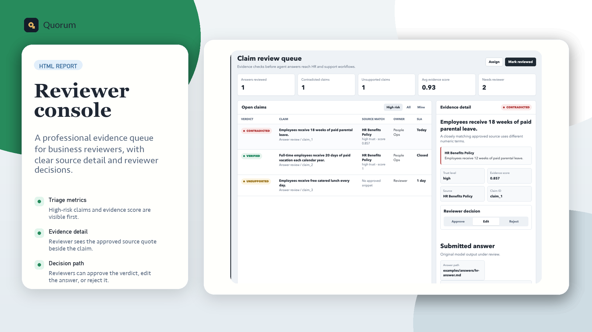

# Quorum

Quorum is an evidence gate for enterprise AI agents. It checks AI-generated business claims against approved company sources before those claims reach customers, employees, tickets, workflows, or downstream systems.

Quorum turns an answer into atomic claims, compares each claim with approved evidence, and labels it `verified`, `contradicted`, `unsupported`, or `needs_review`. The result is a clear, auditable report for human review rather than a black-box answer.

The first wedge is HR and customer-support policy verification: document-grounded workflows where incorrect AI answers are high-volume and risky. Quorum supports single-answer and batch verification, reviewer decision handoffs, machine-readable reports, and CI blocking for selected risky verdicts.

For setup, CLI commands, supported formats, report outputs, metadata, and development checks, see the [README details](docs/readme-details.md). The working product direction is documented in the [roadmap](docs/roadmap.md), with an auto-updated snapshot in [status](docs/status.md).

## Demo Video

[Watch or download the Quorum demo video](docs/assets/quorum-demo.mp4)
